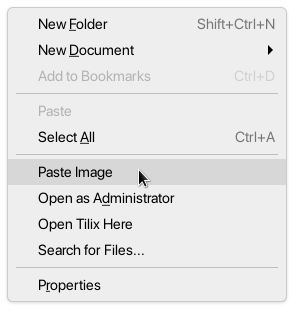
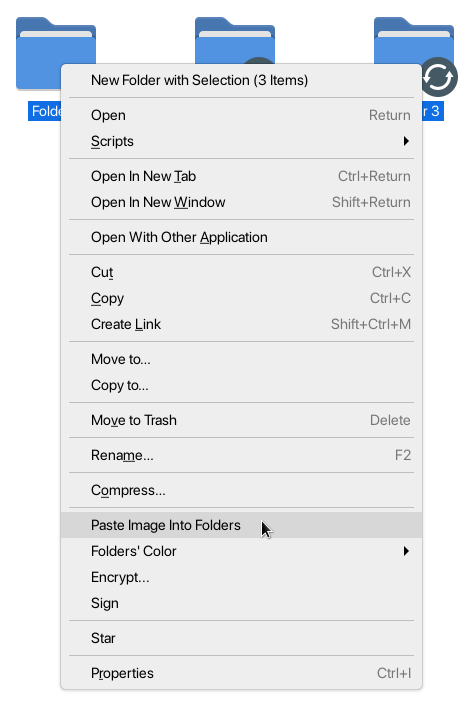

# Nautilus Paste Image

Extension to allow for pasting images from the clipboard into Nautilus. Provides menu items and also the `<Shift><Ctrl>v` shortcut.

## Installation

1. Install [Nautilus Python](https://wiki.gnome.org/Projects/NautilusPython) from your package manager.
   1. For Ubuntu and other Debian-based distributions: `sudo apt-get install python-nautilus`
   2. For Fedora and the like: `sudo dnf install nautilus-python`
2. Download `paste-image.py` and put it in `~/.local/share/nautilus-python/extensions/`. If the directory doesn't already exist, you'll have to make it.
3. Restart Nautilus: `nautilus -q`.

If for some reason the extension doesn't run after that then you might need to make `paste-image.py` executable by running `chmod +x paste-image.py` in the aforementioned extensions directory.

You may need to also install xclip if you don't already have it.

## Screenshots

## Known Issues

There seems to be some problem pasting from Firefox with both xclip and wl-clipboard on Wayland. I _think_ this is a Firefox issue though?
